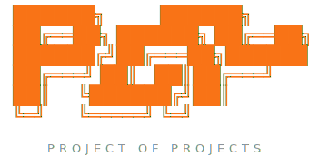
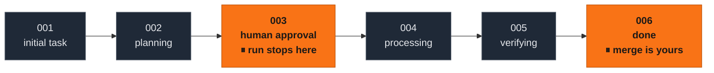

<p align="center">
  
</p>

<p align="center">
  <b>A second brain for everything you build with AI agents.</b>
</p>

<p align="center">
  <a href="#getting-started">Getting started</a> ·
  <a href="#how-it-works">How it works</a> ·
  <a href="#core-skills">Core skills</a> ·
  <a href="#make-it-yours">Make it yours</a>
</p>

<p align="center">
  
  
  
  <a href="LICENSE"></a>
</p>

---

**PoP** is an [Obsidian](https://obsidian.md) vault that catalogs every project in your life — code, writing, work, agents — and gives AI agents the *harness* they need to work on each one: rules, context, specs, skills and a kanban workflow with human approval gates.

This repository does **not** hold your projects' code. It holds their **planning, tracking and agent harness** — and aggregates your real repositories around it.

## Why

Working with AI agents across many projects tends to scatter context everywhere. PoP centralizes it:

- 🗂️ **One vault, all projects** — each with a standard anatomy an agent can navigate blind.
- 🚦 **Humans decide, agents execute** — every task passes a human approval gate before an agent touches real code, and every change ships as a PR that only you merge.
- ♟️ **Plans built like wargames** — recon with parallel subagents, moves with expected observations, forks with triggers, abort conditions, red-teaming. Written so a cheaper executor can run them without asking a single question.
- 🪶 **Frugal context by design** — the main agent orchestrates while dedicated subagents do the reading and the work (delegation by default), every agent-facing link carries a trigger saying *when* to follow it, and stdlib-only Python CLIs replace token-hungry vault sweeps.
- 🧠 **Durable memory** — every finished task leaves a ≤2000-char memory record, so history survives cleanup.
- 🔌 **Agent-agnostic** — skills live in `.agents/skills/` as plain `SKILL.md` files (the open Agent Skills format). No tool-specific folders; works with Claude Code, Cursor, Codex, opencode and anything that reads `AGENTS.md`.

## How it works

Every project lives in a category folder under `categories/` with the same anatomy — a sheet (`PROJECT.md`), a roadmap (`ROADMAP.md` + `roadmap/`, in epochs → phases → tasks), specs, skills, notes, researches, memory and a kanban every task travels through:



<p align="center"><sub>🟧 orange = a human gate — each agent run flows until the next one &nbsp;·&nbsp; ⬛ dark = an agent executes</sub></p>

- **One run = up to the next human gate:** an agent invocation chains the agent-owned stages and only stops where a decision is yours — the release in 001, plan approval in 003, critical verification in 005, a `(user)` item, a block, the merge round in 006. No gate is ever skipped; you stay in the loop.
- **An orchestrator with dedicated subagents:** the main agent handles the card, gates and transitions; a **planner** subagent writes the plan (002), an **executor** runs it (004) and a separate **verifier** judges it with evidence (005) — verifier ≠ executor by design.
- **002 is a wargame:** the planner recons with parallel subagents, then writes a plan a blind executor can follow — route, forks with triggers, abort conditions, acceptance criteria with verification runs, change specs, red-team pass — plus a "Minimal executor context" section, so the executor reads only what it needs (the vault's context protocol).
- **001 ends with your release:** the card is yours to edit until you check `- [x] Ready to plan` — agents (and automation) can't move an unfinished task into planning.
- **003 is yours:** nothing touches a repository until you check `- [x] Done`.
- **004 runs in a git worktree** per task (`worktrees/<id>`, branch `task/<id>`), enabling safe parallel tasks.
- **006 opens a PR** — you merge it, the agent writes the memory record and syncs specs.
- **Yolo mode (opt-in):** mark an epoch, phase or task as yolo on the roadmap and a **critic** agent takes over the judgment gates — tasks are planned, executed and merged into a `develop` branch autonomously, and you review **one** final PR per scope. `critical: true` and real-world `(user)` items still stop for you.

Everything waiting on you shows up in **`INBOX.md`**, generated automatically via Dataview — the one file to open every day.

## Repository structure

```
project-of-projects/
├── AGENTS.md            ← vault rules — the contract every agent reads first (CLAUDE.md → symlink)
├── .agents/skills/      ← the core skills (SKILL.md, agent-agnostic)
├── INDEX.md             ← all projects at a glance + aggregated repositories
├── INBOX.md             ← everything waiting for a human decision (Dataview)
├── WORKFLOW.md          ← the kanban state machine
├── TYPES.md             ← project types: default | included | multi-repo
├── _templates/          ← templates for every standard file
├── notes/               ← vault notes: the harness decision log
├── scripts/             ← stdlib-only Python CLI: status, validation, kanban moves
├── open_questions/      ← the agent's open questions for you (surface in the INBOX)
├── drafts/              ← your project drafts: new/ and import/ (fill a template, let an agent process it)
└── categories/          ← every project category
    ├── agents/          ← AI agents, automations, skills
    ├── applications/    ← applications and software
    ├── writing/         ← articles, books, content
    └── work/            ← professional projects
```

## Core skills

| Skill | What it does |
|-------|--------------|
| `new-project` | Guided interview that creates a project: essence, harness, roadmap, specs. |
| `import-project` | Imports an existing repository: recon, fit interview, and a mandatory Organization epoch. |
| `plan-roadmap` | Builds/evolves a roadmap by interview (epochs → phases → candidate tasks). |
| `new-task` | Quick interview that materializes a task into the kanban. |
| `advance-task` | Moves a task through the flow 001→006, respecting human gates. |
| `yolo-critic` | Critic agent for yolo tasks: adversarial plan approval in 003, task merges into `develop`. |
| `write-spec` | Creates/rewrites a standardized spec. |
| `sync-specs` | Keeps specs faithful to reality as tasks progress. |
| `weekly-review` | Vault-wide review: what waits on you, what stalled, proposals. |

These are the workflow highlights — the full table in `AGENTS.md` covers all skills, including the `clean-code-change`/`clean-code-review` pair (code projects), the `ui-change`/`ui-review` pair (frontend projects) and a vendored batch of 16 frontend/UI/UX skills (design direction, React/Next.js practices, shadcn/ui, color, design tokens, and UX/accessibility audits), each credited with upstream and license.

## Scripts

Stdlib-only Python (≥ 3.9) CLIs in `scripts/` turn agent sweeps into one command — agents (and you) use them instead of walking the tree. All accept `--vault DIR` and `--help`:

```sh
python3 scripts/pop_status.py                          # overview: tasks per stage, pending gates, blocked, WIP alerts
python3 scripts/pop_validate.py                        # limits & invariants: 144/600 chars, note sizes, card frontmatter
python3 scripts/pop_task.py agents/my-project 1.1.1-user-table --title "User table"   # scaffold a task in 001
python3 scripts/pop_move.py 1.1.1-user-table 002_planning --reason "plan started"     # validated stage transition
python3 scripts/pop_worktree.py add 1.1.1-user-table   # create/remove the task's worktree + branch
```

## Getting started

1. **Get the vault** — use this repo as a template (or fork/clone it):
   ```sh
   git clone https://github.com/gabesan21/project-of-projects.git my-vault
   cd my-vault
   ```
2. **Open it in Obsidian** — open the folder as a vault. It comes **pre-configured**: `.obsidian/` is versioned (plugins below plus the [Obsidianite](https://github.com/bennyxguo/Obsidian-Obsidianite) theme, MIT), so the Dataview-powered `INBOX.md` works out of the box; only your per-session `workspace.json` stays gitignored.
3. **Point your agent at it** — open the folder with your AI coding agent. It reads `AGENTS.md` (Claude Code reads it via the `CLAUDE.md` symlink) and learns the whole system from there.
   - **Claude Code — native skill discovery** *(optional but recommended)*: skills live in `.agents/skills/` to stay agent-agnostic, and Claude Code looks for them in `.claude/skills/`. Symlink one into the other — the same trick as `CLAUDE.md → AGENTS.md` — so Claude Code discovers all skills natively (and picks up new ones automatically):
     ```sh
     mkdir -p .claude && ln -s ../.agents/skills .claude/skills
     ```
     Without it Claude Code still works — it reads `AGENTS.md` and follows each `SKILL.md` by hand; the symlink just makes the skills invocable directly. `.agents/skills/` stays the single source of truth.
4. **Create your first project** — ask the agent to run the `new-project` skill (or `import-project` for an existing repository) and answer the interview.
5. **Work the loop** — ask for `new-task`, approve plans in `003_human_approval`, ask for `advance-task` to move stages, merge PRs, and check `INBOX.md` daily. Run `weekly-review` once a week.

## Obsidian plugins

All plugins serve the **human** side — agents never depend on them (`INBOX.md` documents grep equivalents, and `scripts/` covers the sweeps). They ship **pre-installed** in the versioned `.obsidian/` — each is the property of its authors, redistributed under its own license (Dataview, Obsidian Git, Templater, QuickAdd and Excalidraw are MIT), with settings clean of anything personal.

| Plugin | Why |
|--------|-----|
| **Dataview** *(required)* | Powers the `INBOX.md` queries — tasks awaiting approval, critical verifications, pending merges, blocked. |
| **Obsidian Git** | Commit and sync the vault from inside Obsidian — agents commit per session; this covers your manual edits. |
| **Templater** | Point its template folder at `_templates/` to create cards and notes by hand already in the standard format. |
| **QuickAdd** | Quick-capture ideas into a project's `notes/ideas/` without navigating the vault. |
| **Excalidraw** | Visual diagrams in specs, plans and notes — pairs with the optional [excalidraw-diagram skill](https://github.com/coleam00/excalidraw-diagram-skill); `.excalidraw.md` files are exempt from the note line limit. |

## Make it yours

- **Language** — the template ships in English; the vault's language is declared in `AGENTS.md` (rule 1) and each project declares its own default language (plus supported i18n languages for applications). Fork it in any language you like.
- **Categories** — `agents`, `applications`, `writing`, `work` (in `categories/`) are starters. Add your own: create the folder with an `INDEX.md` and register it in `AGENTS.md` and the root `INDEX.md`.
- **Project types** — see `TYPES.md`: keep work inside the vault (`default`), embed the harness in your repo (`included`), or aggregate several repos (`multi-repo`). Clones are always gitignored — the vault stays planning-only.
- **Rules** — the WIP limit, criticality gates and every workflow rule live in `AGENTS.md` and `WORKFLOW.md`. Edit them; the templates in `_templates/` are the single source the skills build from, so keep them in sync.
- **Application context** — programming projects use the **DOX process** (`_templates/DOX.md`): a tree of `AGENTS.md` contract files inside the code, kept honest at every task closeout.

## Credits

- **Developer:** [G. S. Nunes (CariocaWeb3)](https://github.com/gabesan21), using **Fable 5**.
- The application-context model in `_templates/DOX.md` is inspired by the open **DOX** framework (agent0ai/dox, MIT), adapted to be fully self-contained here.
- Skills follow the open **Agent Skills** format (`SKILL.md`), readable by any modern coding agent.
- Visual diagrams are powered by the **[excalidraw-diagram skill](https://github.com/coleam00/excalidraw-diagram-skill)** by [coleam00](https://github.com/coleam00) — an optional external skill that pairs with the Obsidian Excalidraw plugin.

## License

[Apache License 2.0](LICENSE).
