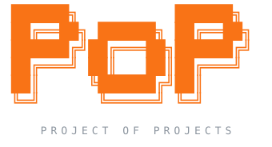
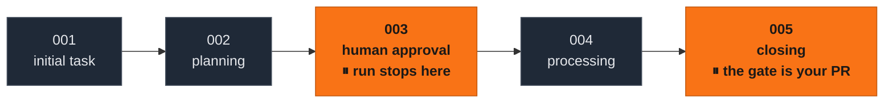

<p align="center">
  
</p>

<p align="center">
  <b>A second brain for everything you build with AI agents.</b>
</p>

<p align="center">
  <a href="#getting-started">Getting started</a> ·
  <a href="#how-it-works">How it works</a> ·
  <a href="#core-skills">Core skills</a> ·
  <a href="#the-vault-is-the-harness-source">Harness source</a> ·
  <a href="#make-it-yours">Make it yours</a>
</p>

<p align="center">
  
  
  
  <a href="LICENSE"></a>
</p>

---

**PoP** is an [Obsidian](https://obsidian.md) vault that catalogs every project in your life — code, writing, work, agents — and gives AI agents the *harness* they need to work on each one: rules, context, specs, skills and a kanban workflow with human approval gates.

This repository does **not** hold your projects' code. It holds their **planning, tracking and agent harness** — and aggregates your real repositories around it.

**What it is for:** letting a **master agent manage many projects at once**. An orchestrator — Openclaw, Hermes Agent, or whatever drives your agents — opens this vault, sees every project through a single index, and operates each of them through the same kanban flow, with the same conventions, templates and scripts. Nothing to relearn per project: the vault is the shared harness, and every project is an independent island exposing an identical contract.

## Why

Working with AI agents across many projects tends to scatter context everywhere. PoP centralizes it:

- 🗂️ **One vault, all projects** — each with a standard anatomy an agent can navigate blind.
- 🚦 **Humans decide, agents execute** — outside yolo, every task passes human approval before real changes and ships as a PR only you merge; yolo keeps its judgment and scope-closeout policy explicit.
- 🧭 **Concise execution briefs** — a separate planner records objective, strategy, ownership fronts, dependencies, risks and criteria without duplicating implementation work.
- 🪶 **Frugal context by design** — execution adapts from one executor to sequential specialists or isolated parallel waves, while stdlib-only Python CLIs replace token-hungry sweeps and validate ownership.
- 🧠 **Durable memory** — every finished task leaves a ≤2000-char memory record, so history survives cleanup.
- 📦 **One harness, distributed** — the vault is the single source of the workflow; standalone repos receive a *managed*, version-stamped copy they never patch locally ([details](#the-vault-is-the-harness-source)).
- 🔌 **Agent-agnostic** — skills live in `.agents/skills/` as plain `SKILL.md` files (the open Agent Skills format). No tool-specific folders; works with Claude Code, Cursor, Codex, opencode and anything that reads `AGENTS.md`.

## How it works

Every project lives in a category folder under `categories/` with the same anatomy — a sheet (`PROJECT.md`), a roadmap (`ROADMAP.md` + `roadmap/`, in epochs → phases → tasks), modifications (`MODIFICATIONS.md` + `modifications/`) for work that arrives outside the plan, specs, skills, notes, researches, memory and a kanban every task travels through:


```mermaid
flowchart LR
    A["001<br/>initial task"] --> B["002<br/>planning"]
    B --> C["003<br/>human approval<br/>⏸ run stops here"]
    C --> D["004<br/>processing"]
    D --> E["005<br/>closing<br/>⏸ the gate is your PR"]
    classDef agent fill:#1f2937,stroke:#4b5563,color:#e5e7eb
    classDef human fill:#f97316,stroke:#c2570c,color:#1c1917,font-weight:bold
    class A,B,D agent
    class C,E human
```

<p align="center"><sub>🟧 orange = a human gate — each agent run flows until the next one &nbsp;·&nbsp; ⬛ dark = an agent executes</sub></p>

- **One run = up to the next human gate:** an agent invocation chains the agent-owned stages and only stops where a decision is yours — the release in 001, plan approval in 003, a `(user)` item, a block, the merge round in `005_closing`. No gate is ever skipped; you stay in the loop.
- **Separated roles:** the main agent handles cards, gates and transitions; a separate **planner** writes a brief (002) and an **execution orchestrator** chooses one executor or specialist fronts (004). In yolo, one independent **reviewer** in a fresh session is the quality gate of `005_closing`; outside yolo there is no agentic reviewer at all — **reviewing the PR is the verification**.
- **Each role reads only its slice:** the plan root stays ≤80 lines at any size and every front destined for a separate context gets its own ≤50-line file in `subtasks/` — an executor receives the card's what/why, the objective, its own front and that front's skill. Never the whole plan.
- **Parallelism with ownership:** fronts run concurrently only when logically independent and writing to independent sets. Each declares `owns`, `must_not_edit` and dependencies; missing inputs are reported, never implemented opportunistically.
- **001 ends with your release:** the card is yours to edit until you check `- [x] Ready to plan` — agents (and automation) can't move an unfinished task into planning.
- **003 is yours:** nothing touches a repository until you check `- [x] Done`.
- **004 integrates in a task worktree** (`worktrees/<id>`, branch `task/<id>`); parallel fronts use isolated branches/worktrees and the orchestrator validates each diff before integration.
- **`005_closing` is one stage, three acts in order** — quality gate, delivery/PR, close-out (memory, specs, roadmap cleanup, folder deletion). **Nothing closes before the gate approves.** Outside yolo it opens the task PR and waits for your merge; external yolo tasks integrate into `develop` and the marked scope (single task, phase/epoch or modification) opens `develop` → `main`; a root-local PoP works directly on `main`.
- **Roadmaps remain lean** — completed task rows leave the epoch or modification file at the close-out of `005_closing`, only after canonical memory/spec/status validation.
- **Yolo is bounded autonomy** — `005_closing` is the single quality gate: a strong fresh critic first checks whether the original request was met, and writes the memory in the same session when it approves; 003 exists only for `critical` tasks. Independent tasks run in waves of at most three.
- **Returns are incremental** — the gate has three exits: approved, execution blocker (→ 004) and plan defect (→ 002). Every return names a delta classified as `lacuna | premissa | execucao`, so only the affected fronts re-run and the re-review is differential over that delta. Two returns per route; the third of the same route opens a human-reset circuit breaker.

Everything waiting on you shows up in **`INBOX.md`**, generated automatically via Dataview — the one file to open every day.

## Repository structure

```
project-of-projects/
├── AGENTS.md            ← vault rules — the contract every agent reads first (CLAUDE.md → symlink)
├── .agents/skills/      ← the core skills (SKILL.md, agent-agnostic)
├── INDEX.md             ← all projects at a glance + aggregated repositories
├── INBOX.md             ← everything waiting for a human decision (Dataview)
├── WORKFLOW.md          ← the kanban state machine
├── TYPES.md             ← project types: default | included | multi-repo
├── specs/               ← durable contracts for the harness itself
├── _templates/          ← templates for every standard file
├── notes/               ← vault notes: the harness decision log
├── scripts/             ← stdlib-only Python CLI: status, validation, kanban moves
├── open_questions/      ← the agent's open questions for you (surface in the INBOX)
├── drafts/              ← your project drafts: new/ and import/ (fill a template, let an agent process it)
└── categories/          ← every project category
    ├── agents/          ← AI agents, automations, skills
    ├── applications/    ← applications and software
    ├── writing/         ← articles, books, content
    └── work/            ← professional projects
```

## Core skills

| Skill | What it does |
|-------|--------------|
| `new-project` | Guided interview that creates a project: essence, harness, roadmap, specs. |
| `import-project` | Imports an existing repository: recon, fit interview, and a mandatory Organization epoch. |
| `plan-roadmap` | Builds/evolves a roadmap by interview (epochs → phases → candidate tasks). |
| `new-task` | Quick interview that materializes a task into the kanban. |
| `advance-task` | Moves a task through the flow 001→`005_closing`, respecting human gates. |
| `judge-dredd` | Judge Dredd, yolo's single judge: `005_closing` gate of every yolo task, judged by reading (003 only for `critical` tasks). |
| `write-spec` | Creates/rewrites a standardized spec. |
| `sync-specs` | Keeps specs faithful to reality as tasks progress. |
| `weekly-review` | Vault-wide review: what waits on you, what stalled, proposals. |
| `optimize-memory` | Compacts memories without losing identity, chronology, commits/PRs or critical decisions. |
| `coding-sandbox` | On explicit request, proposes and creates a confirmed local coding docker that opens one agent's plain interactive TUI in one project. |

These are the workflow highlights — the full table in `AGENTS.md` covers all skills, including the `clean-code-change`/`clean-code-review` pair (code projects), the `ui-change`/`ui-review` pair (frontend projects) and a vendored batch of 16 frontend/UI/UX skills (design direction, React/Next.js practices, shadcn/ui, color, design tokens, and UX/accessibility audits), each credited with upstream and license.

## Scripts

Stdlib-only Python (≥ 3.9) CLIs in `scripts/` turn agent sweeps into one command — agents (and you) use them instead of walking the tree. All accept `--vault DIR` and `--help`:

```sh
python3 scripts/pop_status.py                          # overview: tasks per stage, pending gates, blocked, WIP alerts
python3 scripts/pop_validate.py                        # limits & invariants: 144/600 chars, note sizes, card frontmatter
python3 scripts/pop_task.py agents/my-project 1.1.1-user-table --title "User table"   # scaffold a task in 001
python3 scripts/pop_move.py 1.1.1-user-table 002_planning --reason "plan started"     # validated stage transition
python3 scripts/pop_worktree.py add 1.1.1-user-table   # create/remove the task's worktree + branch
python3 scripts/pop_check_scope.py --base HEAD~1 --allow 'src/**' --deny 'src/generated/**'  # validate front ownership
python3 scripts/pop_sandbox.py new applications/my-project codex  # proposal only; exact hash confirmation writes the local profile
```

Coding dockers are an optional, human-operated flow separate from headless `delegate-coding`. A generated `start.sh` opens exactly one of `claude`, `codex`, `opencode`, `pi`, or `kimi` without extra flags, mounts only the selected project plus the documented local Git/GitHub/agent state, and keeps project Docker resources in its own internal daemon. See [[coding-dockers/INDEX|Local coding dockers]] for setup, lifecycle, and the manual acceptance checklist.

## The vault is the harness source

A project can also run **standalone**: an `included` repo carries its own `pop/` harness, so whoever clones just that repo still has the workflow, the templates, the scripts and the core skills. Those copies are **managed** — this vault is the single source, and a project never evolves its harness locally.

```sh
python3 scripts/pop_install_included.py ../my-repo                 # install or update the managed harness
python3 scripts/pop_install_included.py --check-fresh ../my-repo    # exit 0 = current, exit 1 = behind the source
python3 scripts/pop_install_included.py --sha                       # the source harness version
python3 scripts/pop_install_included.py --audit-manifest            # the manifest covers everything it should
```

Each install mirrors the set declared in `_templates/included-manifest.json` and writes two things into the target's `pop/.included-harness.json`: the source's `content_sha` and the **inventory** of the files it wrote. The stamp is the whole reason "up to date" is checkable — without it, a clone parked on an old version of the flow is indistinguishable from a current one — and `pop_validate.py` turns a stale or unstamped target into a **violation** that `weekly-review` surfaces with the one-command remedy. The inventory is what authorizes the *next* update to prune a retired template or script: only files the installer itself brought before are candidates, because **a managed folder is not an exclusive folder** — your project may keep its own scripts and fixtures in `pop/scripts/`, and an update must never touch them.

Fixing a harness is therefore always a **reinstall**, never an edit to the local copy: a patched copy silently forks the workflow, and the next install overwrites it anyway.

## Getting started

1. **Get the vault** — use this repo as a template (or fork/clone it):
   ```sh
   git clone https://github.com/gabesan21/project-of-projects.git my-vault
   cd my-vault
   ```
2. **Open it in Obsidian** — open the folder as a vault. It comes **pre-configured**: `.obsidian/` is versioned (plugins below plus the [Obsidianite](https://github.com/bennyxguo/Obsidian-Obsidianite) theme, MIT), so the Dataview-powered `INBOX.md` works out of the box; only your per-session `workspace.json` stays gitignored.
3. **Point your agent at it** — open the folder with your AI coding agent. It reads `AGENTS.md` (Claude Code reads it via the `CLAUDE.md` symlink) and learns the whole system from there.
   - **Claude Code — native skill discovery** *(optional but recommended)*: skills live in `.agents/skills/` to stay agent-agnostic, and Claude Code looks for them in `.claude/skills/`. Symlink one into the other — the same trick as `CLAUDE.md → AGENTS.md` — so Claude Code discovers all skills natively (and picks up new ones automatically):
     ```sh
     mkdir -p .claude && ln -s ../.agents/skills .claude/skills
     ```
     Without it Claude Code still works — it reads `AGENTS.md` and follows each `SKILL.md` by hand; the symlink just makes the skills invocable directly. `.agents/skills/` stays the single source of truth.
4. **Create your first project** — ask the agent to run the `new-project` skill (or `import-project` for an existing repository) and answer the interview.
5. **Work the loop** — ask for `new-task`, approve plans in `003_human_approval`, ask for `advance-task` to move stages, merge PRs, and check `INBOX.md` daily. Run `weekly-review` once a week.

## Obsidian plugins

All plugins serve the **human** side — agents never depend on them (`INBOX.md` documents grep equivalents, and `scripts/` covers the sweeps). They ship **pre-installed** in the versioned `.obsidian/` — each is the property of its authors, redistributed under its own license (Dataview, Obsidian Git, Templater, QuickAdd and Excalidraw are MIT), with settings clean of anything personal.

| Plugin | Why |
|--------|-----|
| **Dataview** *(required)* | Powers the `INBOX.md` queries — tasks awaiting release, awaiting approval, awaiting merge, blocked. |
| **Obsidian Git** | Commit and sync the vault from inside Obsidian — agents commit per session; this covers your manual edits. |
| **Templater** | Point its template folder at `_templates/` to create cards and notes by hand already in the standard format. |
| **QuickAdd** | Quick-capture ideas into a project's `notes/ideas/` without navigating the vault. |
| **Excalidraw** | Visual diagrams in specs, plans and notes — pairs with the optional [excalidraw-diagram skill](https://github.com/coleam00/excalidraw-diagram-skill); `.excalidraw.md` files are exempt from the note line limit. |

## Make it yours

- **Language** — the template ships in English; the vault's language is declared in `AGENTS.md` (rule 1) and each project declares its own default language (plus supported i18n languages for applications). Fork it in any language you like.
- **Categories** — `agents`, `applications`, `writing`, `work` (in `categories/`) are starters. Add your own: create the folder with an `INDEX.md` and register it in `AGENTS.md` and the root `INDEX.md`.
- **Project types** — see `TYPES.md`: keep work inside the vault (`default`), embed the harness in your repo (`included`), or aggregate several repos (`multi-repo`). Clones are always gitignored — the vault stays planning-only.
- **Rules** — the WIP limit, criticality gates and every workflow rule live in `AGENTS.md` and `WORKFLOW.md`. Edit them; the templates in `_templates/` are the single source the skills build from, so keep them in sync.
- **Application context** — programming projects use the **DOX process** (`_templates/DOX.md`): a tree of `AGENTS.md` contract files inside the code, kept honest at every task closeout.

## Credits

- **Developer:** [G. S. Nunes (CariocaWeb3)](https://github.com/gabesan21), using **Fable 5**.
- The application-context model in `_templates/DOX.md` is inspired by the open **DOX** framework (agent0ai/dox, MIT), adapted to be fully self-contained here.
- Skills follow the open **Agent Skills** format (`SKILL.md`), readable by any modern coding agent.
- Visual diagrams are powered by the **[excalidraw-diagram skill](https://github.com/coleam00/excalidraw-diagram-skill)** by [coleam00](https://github.com/coleam00) — an optional external skill that pairs with the Obsidian Excalidraw plugin.

## License

[Apache License 2.0](LICENSE).
